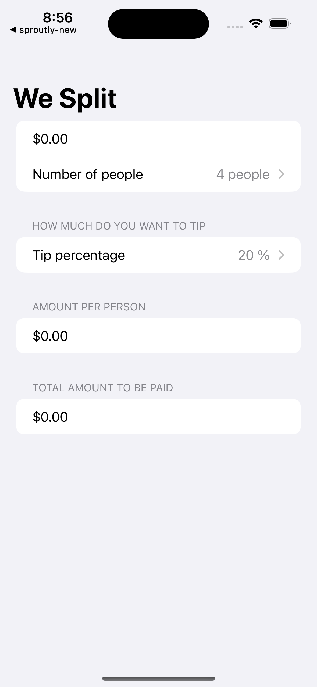
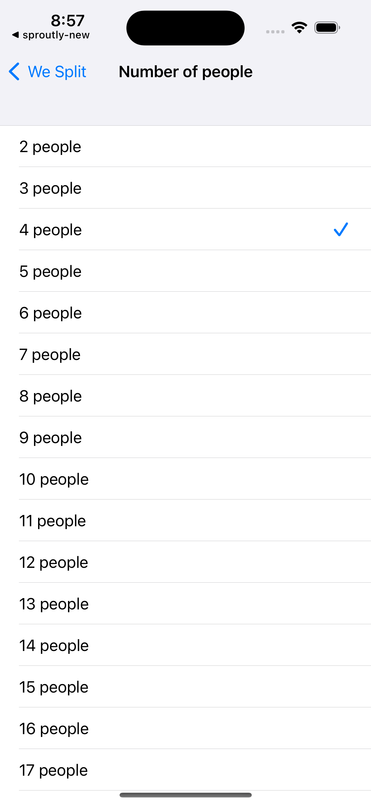
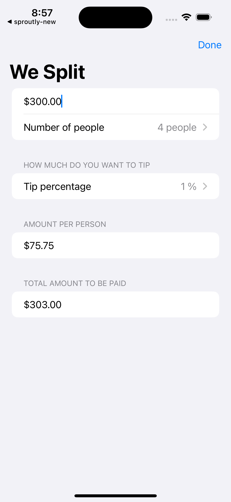

# WeSplit - Tip Calculator App

WeSplit is a tip calculator iOS app built with SwiftUI. It helps users split bills and calculate tips based on various inputs.

## Overview

This project is part of the "100 Days of SwiftUI" tutorial series from [Hacking with Swift](https://www.hackingwithswift.com/100/swiftui#). It focuses on building a tip calculator app using SwiftUI, covering UI layout, input handling, state management, and more.

## Tutorial Details

- **Tutorial Title:** 100 Days of SwiftUI
- **Tutorial Author:** [Hacking with Swift](https://www.hackingwithswift.com)
- **Tutorial Link:** [Tutorial Link](https://www.hackingwithswift.com/100/swiftui#)

## Description

"WeSplit" is a tip calculator app where users can split bills among a group and calculate the tip based on the total bill amount, number of people, and desired tip percentage. It demonstrates SwiftUI concepts and features learned during the tutorial series.

## Features

- Calculates the total per person based on bill amount, tip percentage, and number of people.
- Utilizes SwiftUI's `VStack`, `HStack`, for UI layout.
- Implements `Picker` and `TextField` for user inputs.
- Manages local state using the `@State` property wrapper.
- Uses the `FocusState` wrapper to manage hiding the number keyboard.
- Demonstrates basic SwiftUI concepts and user interface elements.

## Screenshots





## Usage

1. Clone the repository.
2. Open the project in Xcode.
3. Explore various SwiftUI concepts used in the "WeSplit" app.
4. Run the app on a simulator or a physical device to experience the functionality.

## Requirements

- iOS 14.0+
- Xcode 13.0+
- Basic familiarity with SwiftUI concepts

## Installation

1. Clone the repository:

```bash
git clone https://github.com/your-username/project-name.git
```

2. Open the project in Xcode:

```bash
cd project-name
open ProjectName.xcodeproj
```

3. Explore the codebase, experiment with SwiftUI features, and run the app to see the tip calculator in action.


